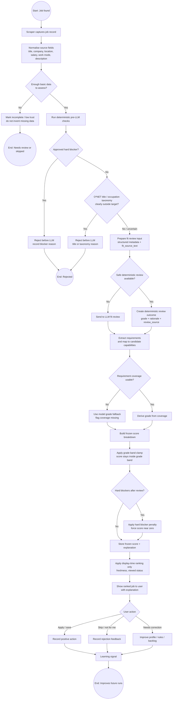

# Fit Score Rationale

Private reference doc. Not committed to the repo.

Last checked against code: 2026-06-08.

---

## What the score is

The fit score is a **ranking signal**, not a qualification percentage.

A score of 57 does **not** mean the candidate is 57% qualified. It means the job is ranked at that level by the current scoring rules, grade band, preferences, freshness, and blockers.

The system answers:

> Which jobs should be reviewed first, which are stretches, and which should be pushed down or rejected?

It does **not** answer:

> Is the candidate objectively qualified for this job?

---

## Current implemented model

The current model is **band-anchored scoring**.

The review grade defines the allowed score band. Other signals move the job inside that band. Hard blockers are applied after the band clamp and can force the score near zero.

The scoring rules are loaded from:

```text
data/knowledge/scoring_rules.json
```

The main scoring consumer is:

```text
job_hunter_agent/fit_scoring.py
```

The requirement-coverage grade derivation is in:

```text
job_hunter_agent/llm_gate.py
```

---

## Process flow overview

This section is the high-level process map for the scoring pipeline. Treat each referenced module or doc as a subprocess owner, not as duplicate instructions to be reimplemented here.

Primary visual diagram:

```text
docs/diagrams/scoring_process_flow.mmd
```

Inline renderable copy:



### Process stages

| Stage | Input | Owner / subprocess | Output | Decision point |
|---|---|---|---|---|
| Source normalisation | Raw scraper fields | `source_connector.py`, scraper modules, source docs | Normalised job record | Missing or low-trust source fields may reduce confidence. |
| Title and occupation filtering | Job title, profile target roles, target occupation queries | `filters.py`, `occupation_taxonomy.py`, `docs/OCCUPATION_TAXONOMY_RATIONALE.md` | Title reason, O*NET near/far/uncertain signal | Approved hard blockers may stop the job before LLM. Uncertain signals continue. |
| Description preparation | Full description, structured scraper metadata | `description_compactor.py`, `description_trust.py`, config/rules governance | `fit_source_text`, description trust metadata | Unsafe compaction is skipped explicitly; full description remains preserved. |
| Review outcome | Title/content signals and fit source text | `llm_gate.py`, `source_learning.py` deterministic shortcut | `llm_fit_grade`, requirement coverage, rationale fields | LLM call may be avoided only by explicit deterministic rules. |
| Requirement coverage | Extracted job requirements, candidate capabilities | `llm_gate.py`, capability knowledge/profile modules | Supported / partially supported / not shown / mismatch coverage | Coverage drives grade when present. Unsupported capability claims are dropped. |
| Frozen scoring | Reviewed job record with `llm_fit_grade` | `fit_scoring.py`, `data/knowledge/scoring_rules.json` | Frozen score and score breakdown | Grade band clamps non-hard-block score. Hard blockers apply after clamp. |
| Display scoring | Frozen score, current age/viewed state | `fit_scoring.py`, UI consumers | Displayed score and ordering | Freshness/viewed status can move displayed rank, not capability proof. |
| Human review and learning | User keep/skip/apply/reject decisions | Review history, learning modules, backlog if needed | Future profile/rule improvements | Learning must not silently become hidden scoring logic. |

### Handover points

The main handover from filtering to scoring is the reviewed job record containing `llm_fit_grade`. If that grade is missing, scoring must stop rather than inventing a score.

The main handover from LLM review to scoring is `requirement_coverage`. Coverage is evidence for the grade; the score breakdown displays it for transparency but does not add a second independent capability bonus.

The main handover from frozen scoring to the UI is the stored frozen score plus explanation entries. Display-time freshness and viewed status are ranking adjustments only, not new evidence that the candidate fits the job.

### End states

A job can end as pre-LLM rejected, LLM/deterministic rejected, kept for review, displayed lower due to weak fit or hard blockers, or improved later through user feedback. Only reviewed jobs with a valid grade enter the normal scoring pipeline.

---

## Grade bands

The grade controls the non-hard-block score range.

| Grade | Base points | Band | Meaning |
|---|---:|---:|---|
| EXCELLENT | 78 | 88-100 | Exceptional alignment |
| STRONG | 52 | 68-87 | Strong fit |
| SOLID | 32 | 48-67 | Decent fit |
| WEAK | 18 | 28-47 | Limited alignment |
| POOR | 6 | 8-27 | Poor alignment |
| MISMATCH | 0 | 0-7 | Clear mismatch |

The score is first built from normal score entries. Then the grade band is applied:

- If the raw non-hard-block score is below the grade floor, a positive **Grade band floor** entry is added.
- If the raw non-hard-block score is above the grade ceiling, a negative **Grade band ceiling** entry is added.
- Hard block penalties are excluded from the band clamp.
- Final score is capped between 0 and 100.

---

## Current scoring flow

### 1. Review state gate

A job cannot be scored unless `llm_fit_grade` is present.

If the job has not been reviewed, scoring raises an error instead of inventing a score.

### 2. Core fit entries

Core entries include:

| Signal | Current behaviour |
|---|---|
| Title direct match | Adds `title_direct` points, currently 15 before weighting. |
| Title secondary/potential match | Adds `title_secondary` points, currently 4 before weighting. |
| LLM / derived grade | Adds base grade points from `llm_grade_points`. |
| Requirement coverage | Displayed as transparency entries with value 0. |
| Content passed | Adds `content_ok`, currently 3 before weighting. This means no content blocker was found; it is not proof of capability fit. |
| Description capture incomplete | Adds a negative entry, currently -8 before weighting. |
| Convergence | Adds +5 or +3 before weighting only when strong independent signals align. |
| Competitive signals | Adds or subtracts small specialist-domain adjustments. |

### 3. Preference entries

Preference entries include location and salary/rate.

They help ranking, but they must not be read as evidence that the candidate meets mandatory job requirements.

### Location scoring decision

Current location matching is intentionally conservative. The search location usually comes from the same candidate setting that is sent to SEEK and LinkedIn, so a broad location match often proves only that the source query worked.

Until proper radius, commute, and near-home support exists, location should be treated as a weak preference signal rather than strong fit evidence:

- a clear broad match may keep the job from being penalised
- unclear, hybrid, or source-normalised locations should stay visible for review
- location should not inflate the score as if it proves role quality
- out-of-area hard filtering belongs to explicit exclusion/radius rules, not implicit score bonuses

Future radius support should make the decision explicit: jobs can then be compared against a home/suburb plus distance threshold, with uncertain geocoding preserved for review rather than silently discarded.

### 4. Convenience entries

Convenience entries include:

| Signal | Behaviour |
|---|---|
| Freshness | Added dynamically from current posted age. Currently +10 within 6 hours, +8 within 1 day. |
| Already viewed | Added dynamically as -3 if viewed and not applied. |

### 5. Grade band clamp

The non-hard-block entries are summed and clamped to the current grade band.

There are two scoring variants:

| Function | Behaviour |
|---|---|
| `fit_score_breakdown_frozen` / `fit_score_frozen` | Stored at scrape/review time. Excludes freshness and viewed status. |
| `fit_score_and_breakdown_displayed` / `fit_score_displayed` | Display-time score. Starts from frozen score, then adds current freshness and viewed status. Falls back to live scoring for old records without a frozen score. |

### 6. Hard blockers

Hard blockers are applied after the band clamp.

Each hard blocker currently adds a `hard_block_penalty` of -100.

This means a job can have a good grade but still be forced near zero if it has a hard blocker.

---

## Requirement coverage and grade derivation

`requirement_coverage` is the source of truth for capability support when LLM coverage is available.

Allowed coverage statuses:

| Status | Meaning |
|---|---|
| supported | Requirement directly supported by a known profile capability. Must include `capability_name`. |
| partially_supported | Partial or indirect support. Must include `capability_name`. |
| not_shown | No candidate evidence found. |
| mismatch | Explicit conflict. |

Coverage entries are shown in the score breakdown for transparency, but they do not add separate score points.

The grade is derived from coverage when coverage exists. The model's raw grade is used only as fallback when coverage is missing.

Current importance weights used by `derive_fit_review_grade`:

| Importance | Weight |
|---|---:|
| mandatory | 3.0 |
| strongly_preferred | 2.0 |
| preferred | 1.0 |
| nice_to_have | 0.25 |

Current derivation rules:

- `supported` contributes full weight.
- `partially_supported` contributes half weight.
- `not_shown` contributes zero but still counts against the maximum possible score.
- `mismatch` contributes zero and caps the grade at WEAK if there is any coverage.
- Missing coverage items from `job_requirements` are treated as uncovered preferred-weight items.
- If there are no covered items, the grade becomes MISMATCH when a mismatch exists, otherwise POOR.
- Full support across all requirements gives EXCELLENT only when there are at least 3 requirements; otherwise STRONG.
- Strong coverage ratio can produce STRONG.
- Moderate coverage ratio can produce SOLID.
- Low coverage produces WEAK.

Important limitation:

Mandatory `not_shown` lowers the weighted ratio but does not automatically reject the job. That is deliberate for now, because a missing profile capability may mean the candidate profile is incomplete rather than the candidate cannot do it.

### Missing CV evidence default

Default rule for new or incomplete profiles:

- if a capability, tool, certification, clearance, domain, or role duration is not present in the runtime profile, the system must not claim the candidate has it
- missing evidence is treated as `not_shown`, not as supported evidence
- missing evidence can lower requirement coverage and score
- missing evidence should not automatically become a hard rejection unless an approved hard-block rule applies
- when the missing item looks important, surface it as a visible gap or review signal so the user can improve the profile if the CV omitted real experience

This keeps the system strict without pretending the CV is perfect. The profile is the current evidence source, not an omniscient model of the candidate.

---

## Deterministic pre-LLM review shortcut

Some jobs can be decided before the LLM review.

The shortcut is implemented in:

```text
job_hunter_agent/source_learning.py
```

Function:

```text
deterministic_review_outcome
```

It uses:

- title reason
- count of strong fit highlights
- count of missing profile support items
- count of soft risk reasons
- thresholds from `deterministic_review_thresholds` in `scoring_rules.json`

Current outcomes:

| Rule | Outcome |
|---|---|
| Too many high risks and too few strong signals | REJECT / MISMATCH |
| Potential title plus high risk and weak signals | REJECT / POOR |
| OK title plus enough strong signals and no high risks | KEEP / STRONG |
| OK title plus enough strong signals, no high risks, and limited medium risks | KEEP / SOLID |

These rule-based outcomes still produce `llm_fit_grade` and can therefore be scored by the same scoring pipeline.

---

## Capability support rules

Capability support is not a free-text bonus bucket.

Current principle:

> Do not match whole job sentences directly to capabilities.

The LLM should extract job requirements, then map each requirement to candidate-side capabilities or evidence.

A supported or partially supported requirement must name a known `capability_name`. If the LLM returns support without a valid capability name, the coverage item is dropped during normalisation.

This prevents the system from treating a job sentence as proof of capability merely because words overlap.

---

## What is deliberately not counted as capability proof

These signals can help ranking but should not prove mandatory requirement fit:

- location
- salary/rate
- work mode
- work type / contract preference
- freshness
- content passed
- viewed/not viewed status
- competitive-domain hints by themselves

They are useful for ordering jobs, not for proving the candidate meets the role.

---

## Reviewed signal registry

Reviewed signal decisions from `signal_registry.json` are intentionally excluded from direct scoring.

Approving a signal means:

> Learn how to classify or map this term next time.

It does not mean:

> Add points to every job mentioning this word.

Signals can later be promoted into normalised profile rules or capability mappings, but they do not directly add score points.

---

## Design basis

The model is an **auditable ranking model with configured rules and LLM-derived requirement coverage**.

Do not describe the current design as simply "heuristic scoring" without qualification. That wording is too broad and makes it sound like the system is mainly a pile of hardcoded guesses. The current direction is more specific:

- use the LLM to extract job requirements and requirement coverage
- derive the grade from structured coverage where available
- keep scoring values in managed config, not hidden code constants
- show requirement coverage as transparent evidence
- keep logistics/preferences separate from capability proof
- keep remaining rule-based shortcuts explicit, logged, and configurable

There are still heuristic elements, but they are now treated as **controlled calibration rules**, not as the core source of truth.

Remaining heuristic / calibration areas include:

| Area | Current status |
|---|---|
| Grade band values | Configured in `scoring_rules.json`; not empirically proven. |
| Preference weights | Managed/profile-side weights; affect ranking, not capability proof. |
| Deterministic shortcut thresholds | Configured under `deterministic_review_thresholds`; should be audited via `review_source` and `det_rule`. |
| Convergence bonus | Explicit rule-based bonus; useful but still a calibration rule. |
| Freshness bonus | Ranking urgency only; not fit evidence. |

The model is grounded in:

- person-job fit theory: job requirements should be compared to candidate attributes
- multi-criteria decision analysis: heterogeneous signals can be combined when weights are explicit and auditable
- competency-based hiring: capability and evidence alignment are central
- recruiter screening behaviour: title and role alignment matter early
- practical job search workflow: freshness and logistics affect action priority, not capability fit

The specific point values are calibration choices, not empirically proven constants.

They should be calibrated over time against real outcomes such as:

- reviewed jobs
- jobs skipped manually
- applications submitted
- recruiter responses
- interviews
- false positives
- false rejections

---

## Recent removals / direction of travel

Recent scoring and matching work has been moving away from hidden hardcoded judgement and toward explicit, reviewable mechanisms.

Current direction:

| Old / risky pattern | Replacement direction |
|---|---|
| Whole job sentence matched directly to a capability | Extract requirement first, then map it to a known candidate capability. |
| Capability mentions adding independent score points | Requirement coverage drives grade; coverage entries are transparency-only in the score breakdown. |
| Broad "fit" claims based on preferences or logistics | Preferences move ranking only; they do not prove mandatory fit. |
| Hidden hardcoded scoring budget | Band-anchored score controlled by `data/knowledge/scoring_rules.json`. |
| Hardcoded judgement buried in code | Move values to managed config / global settings where possible. |
| Signals directly boosting score | Reviewed signals inform future classification/mapping; they do not directly add points. |
| Scoring every scraped record regardless of review state | Scoring is blocked unless `llm_fit_grade` exists. |

Important wording rule:

> The system may still contain calibrated rules, but the intended architecture is not "heuristics decide fit." The intended architecture is "LLM extracts requirements, structured coverage derives the grade, configured scoring ranks the reviewed job, and remaining heuristics are explicit and auditable."

---

## Current known limitations

1. The grade derivation is coverage-based only when `requirement_coverage` exists. If coverage is missing, the model grade can still be used as fallback.
2. Mandatory missing evidence does not automatically reject. It reduces the weighted coverage score but may still allow weak/solid outcomes depending on the rest of the coverage.
3. Preference signals can move jobs within grade bands and can affect display-time ranking, but they are not capability evidence.
4. Frozen score and displayed score can differ because freshness and viewed status are applied dynamically at display time.
5. Deterministic shortcuts can produce review grades without an LLM call. These should be audited separately via `review_source` and `det_rule`.
6. Convergence bonus currently requires supported coverage count, clean title/content, high description confidence, and eligible grade. It is useful but still a calibrated rule, not hard proof of fit.
7. Some older docs and backlog items may still use broad "heuristic" language. Treat that as technical debt unless it points to an actual remaining hardcoded judgement.

---

## Do not redesign during bug fixes

Do not opportunistically rewrite scoring during unrelated fixes.

Safe changes:

- update labels
- fix stale documentation
- fix broken config loading
- fix score display bugs
- add logging
- add tests around existing behaviour

Unsafe changes without explicit approval:

- changing grade bands
- changing coverage thresholds
- adding new scoring categories
- making mandatory gaps auto-reject
- changing deterministic shortcut thresholds
- making signal registry entries add direct score points
