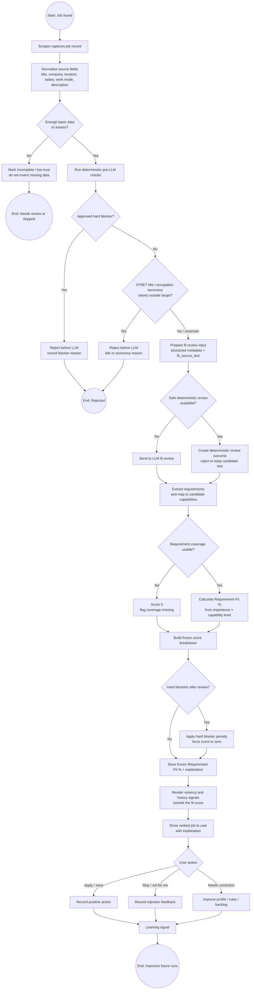

# Fit Score Rationale

Private reference doc. Not committed to the repo.

Last checked against code: 2026-08-04.

---

## What the score is

The fit score is **Requirement Fit % + occupation alignment adjustment**:

```text
final_score = requirement_fit + occupation_adjustment
final_score = clamp(final_score, 0, 100)
```

`requirement_fit` answers:

> How well does the candidate profile cover the job's stated requirements?

`occupation_adjustment` answers a separate question:

> Is this the same occupation as the candidate's target roles, an adjacent one, or a different one?

A requirement_fit of 57 means the candidate covered about 57% of the weighted job requirements based on requirement importance and the typed requirement coverage returned by review. The occupation adjustment then shifts the final score down (never up) if the job is not classified as the same occupation.

It does **not** include title bonus, salary, location, freshness, easy/quick apply, viewed status, LLM grade points, or grade-band clamping.

---

## Current implemented model

The current model is **requirement-coverage scoring plus a deterministic occupation alignment adjustment**.

The LLM still extracts job requirements and maps each requirement to either a candidate capability or an explicit eligibility fact. `fit_scoring.py` then calculates:

```text
Requirement Fit % =
weighted capability credit and eligibility support
/
sum(requirement importance weight)
× 100
```

Requirement importance weights:

```text
required = 3.0
expected = 2.0
preferred = 1.0
bonus = 0.25
```

Candidate capability credits:

```text
strong = 1.00
working = 0.70
basic = 0.35
low / limited_depth = 0.15
not_shown = 0
mismatch = 0
```

If the LLM marks a requirement as covered but the mapped capability or eligibility fact cannot be resolved in the candidate profile, the score does not get inflated. The code writes a structured uncertainty event to `output/uncertainty.jsonl` and records a reviewable warning in the `system_warnings` table.

A resolved capability name is not enough by itself. Post-LLM validation also requires candidate evidence to cover a substantive element of the requirement wording. Broad transferable relationships are normalized to `not_shown` and receive zero credit. For genuine partial matches, `covered_requirement_elements` records which exact part of the requirement is supported.

Requirements that collectively define the specialist nature of a role may be marked with `role_defining=true` and a shared `role_defining_group`. When a configured proportion of that group is uncovered, `role_defining_gap_control` in `data/knowledge/scoring_rules.json` caps the Requirement Fit score so routine generic duties cannot create a misleading Strong Match. The LLM identifies the group; server-side managed scoring rules own the threshold and numeric cap.

### Occupation alignment adjustment

Separately from requirement coverage, the LLM classifies the job's occupation relative to the candidate's target roles, based on job title, dominant duties, and candidate target roles. The LLM returns only the classification and a short reason — never a point value.

```text
same = 0
adjacent = -10
different = -20
```

These adjustments are managed values in `data/knowledge/scoring_rules.json` (`occupation_alignment`), looked up server-side by `_occupation_alignment_adjustments()` in `fit_scoring.py`. The LLM cannot choose the numeric penalty, and an unclassified or invalid value (missing, or outside `same`/`adjacent`/`different`) never rejects the job — it degrades to a "needs review" state with a zero adjustment.

The adjustment is applied after Requirement Fit % and before the final 0–100 clamp:

```text
final_score = clamp(requirement_fit + occupation_adjustment, 0, 100)
```

Alignment, reason, adjustment, and the final calculation are logged in `server.log` at DEBUG level (`./run --debug`) and shown in the "Debug: LLM fit review" panel via `occupation_alignment_diagnostics()` / `format_occupation_alignment_diagnostics_block()` in `fit_scoring.py`.

The main scoring consumer is:

```text
job_hunter_agent/fit_scoring.py
```

The LLM requirement extraction and coverage normalisation remain in:

```text
job_hunter_agent/llm_gate.py
```

---

## Process flow overview

This section is the high-level process map for the scoring pipeline. Treat each referenced module or doc as a subprocess owner, not as duplicate instructions to be reimplemented here.

Primary visual diagram:

```text
docs/diagrams/scoring_process_flow.mmd
```

Openable render:

```text
docs/diagrams/scoring_process_flow.html
```

Regenerate standalone diagram HTML after Mermaid layout/config changes:

```text
./.venv/bin/python scripts/regenerate_diagram_html.py
```

Inline renderable copy:



### Process stages

| Stage | Input | Owner / subprocess | Output | Decision point |
|---|---|---|---|---|
| Source normalisation | Raw scraper fields | `source_connector.py`, scraper modules, source docs | Normalised job record | Missing or low-trust source fields may reduce confidence. |
| Title and occupation filtering | Job title, profile target roles, target occupation queries | `filters.py`, `occupation_taxonomy.py`, `docs/OCCUPATION_TAXONOMY_RATIONALE.md` | Title reason, O*NET near/far/uncertain signal | Approved hard blockers may stop the job before LLM. Uncertain signals continue. |
| Description preparation | Full description, structured scraper metadata | `description_compactor.py`, `description_trust.py`, config/rules governance | `fit_source_text`, description trust metadata | Unsafe compaction is skipped explicitly; full description remains preserved. |
| Review outcome | Title/content signals and fit source text | `llm_gate.py`, `source_learning.py` deterministic shortcut | `llm_fit_grade`, requirement coverage, rationale fields | LLM call may be avoided only by explicit deterministic reject rules. Deterministic keep candidates still require full LLM requirement coverage before any final KEEP is saved. |
| Requirement coverage | Extracted job requirements, candidate capabilities and profile evidence | `llm_gate.py`, capability knowledge/profile modules | Supported / partially supported / not shown / mismatch coverage, covered requirement elements, optional role-defining group | Coverage is the source of truth for Requirement Fit %. Capability-name validity and semantic evidence are both required. Broad transferable matches are downgraded to `not_shown`; unsupported mappings are logged and recorded as admin warnings. |
| Frozen scoring | Reviewed job record with requirement coverage | `fit_scoring.py` | Frozen Requirement Fit % and score breakdown | No title, salary, location, freshness, easy apply, viewed status, LLM grade points, or grade-band clamp. Hard blockers remain visible and can force score to zero. |
| Display scoring | Frozen Requirement Fit % | `fit_scoring.py`, UI consumers | Displayed score and ordering | Recency is handled separately from fit score and should not be treated as fit evidence. |
| Human review and learning | User keep/skip/apply/reject decisions | Review history, learning modules, backlog if needed | Future profile/rule improvements | Learning must not silently become hidden scoring logic. |

### Handover points

The main handover from filtering to scoring is the reviewed job record containing LLM requirement coverage. If the reviewed record is missing its LLM review state, scoring must stop rather than inventing a score.

The main handover from LLM review to scoring is `requirement_coverage`. Coverage now directly drives Requirement Fit %. A deterministic keep candidate is not complete until this coverage exists and the final reviewed record is saved from the LLM path.

The main handover from frozen scoring to the UI is the stored frozen Requirement Fit % plus explanation entries. The user-facing fit explanation should come from `requirement_coverage` only. Recency remains part of the UI and history flow, but it is not new evidence that the candidate fits the job.

### End states

A job can end as pre-LLM rejected, LLM/deterministic rejected, kept for review, displayed lower due to weak fit or hard blockers, or improved later through user feedback. Only reviewed jobs with a valid grade and non-empty requirement coverage enter the normal scoring pipeline.

---

## Grade bands

Requirement Fit % is calculated directly from requirement coverage.

| Input | Behaviour |
|---|---|
| Requirement importance | Determines how much the requirement matters in the denominator. |
| Mapped candidate capability | Resolves which candidate capability covers the requirement. |
| Candidate capability level | Determines coverage credit: strong, working, basic, low, or zero. |
| `not_shown` / `mismatch` | Adds zero coverage and is counted separately. |
| Explicit years/months requirement | When requirement text names a duration threshold, the fit-review LLM names the matching stored `role_experience` family (`matched_role_family`) and `experience_requirements.py` compares that family's accumulated months against the threshold: enough → coverage stands; short → `experience_duration_gap` and a downgrade to `partially_supported`; no family safely resolved → `experience_requirement_review_needed`, left for human review. No duration is stored on the profile. |
| Unknown mapped capability | Adds zero coverage and writes `requirement_capability_mapping_uncertain` to `output/uncertainty.jsonl` plus a system warning. |

The raw score breakdown behind this table is not shown on job cards outside debug mode. In debug mode it appears in the card's "Debug: LLM fit review" panel — see [Job Card Layout](USER_GUIDE.md#job-card-layout) in the user guide.

The normal-mode "Why this is a good fit" section should come from `requirement_coverage` only, and it should stay short. Debug mode may also show score calculation, matched text, capability mapping, and reviewed-signal evidence.

---

## Current scoring flow

### 1. Review state gate

A job cannot be scored unless the LLM review state is complete.

If the job has not been reviewed, scoring raises an error instead of inventing a score.

### 2. Requirement Fit % entries

The main score includes requirement coverage and the occupation alignment adjustment (see step 4):

| Signal | Current behaviour |
|---|---|
| Requirement coverage | Directly calculates Requirement Fit %. |
| Candidate capability level | Strong / working / basic / low determines coverage credit. |
| Candidate eligibility fact | True eligibility support counts as covered; false or missing facts do not. |
| Stored role duration evidence | Explicit "X years/months" requirements are downgraded to `partially_supported` (with the gap shown) when the LLM-named `role_experience` family cannot prove the threshold, and left for review when no family safely resolves. Duration is never stored on the profile. |
| Required gaps | Shown as warnings with zero additional score effect. |
| Required weak coverage | Shown as warnings with zero additional score effect. |
| Unknown mapped capability or eligibility fact | Logged to `output/uncertainty.jsonl` and the admin warning store. |

### 3. Context entries

Salary, location, freshness, Easy Apply / Quick Apply, viewed status, and action recommendations are still shown in the UI, but they are metadata, filter, sort, or check signals rather than fit evidence.

| Signal | Behaviour |
|---|---|
| Salary / rate | Shown as context and used for salary filtering / comparison. |
| Location | Shown as metadata and search context only. |
| Freshness | Used for recency and sorting, not proof of fit. |
| Easy Apply / Quick Apply | Shown as action metadata, not fit evidence. |
| Already viewed | Shown as history-aware display state. |
| Checks before applying | Shown as a review panel for missing requirements, red flags, salary issues, and similar pre-apply checks. |

### 4. Occupation alignment adjustment

| Signal | Current behaviour |
|---|---|
| `occupation_alignment` (`same`/`adjacent`/`different`) | LLM-classified; adjustment value (`0`/`-10`/`-20`) is looked up server-side from `scoring_rules.json`, never chosen by the LLM. |
| Missing or invalid classification | Degrades to a "needs review" state with a zero adjustment. Never rejects the job. |
| Reason, adjustment, and final calculation | Logged in `server.log` at DEBUG level and shown in the "Debug: LLM fit review" panel. |

### 5. Frozen/display score

There are two scoring variants:

| Function | Behaviour |
|---|---|
| `fit_score_breakdown_frozen` / `fit_score_frozen` | Stored at scrape/review time as Requirement Fit % plus occupation alignment adjustment. |
| `fit_score_and_breakdown_displayed` / `fit_score_displayed` | Display-time score. Starts from the frozen score. Falls back to live scoring for old records without a frozen score. |

### 6. Hard blockers

Hard blockers are applied after Requirement Fit % is calculated.

Each hard blocker currently adds a `hard_block_penalty` of -100.

This means a job can have good requirement coverage but still be forced to zero if it has a hard blocker.

---

## Requirement coverage and grade derivation

`requirement_coverage` is the source of truth for capability support when LLM coverage is available.

Allowed coverage statuses:

| Status | Meaning |
|---|---|
| supported | Requirement directly supported by a known profile capability or eligibility fact. Must include the matching profile fact name. |
| partially_supported | Candidate evidence proves a meaningful component of the actual requirement, but not the whole requirement. A broadly transferable capability alone is not partial support. Must include the matching profile fact name. |
| not_shown | No candidate evidence found. |
| mismatch | Explicit conflict. |

Coverage entries are shown in the score breakdown for transparency, but they do not add separate score points.

The fit score is intentionally narrow: requirement-coverage transparency, the occupation alignment adjustment, and hard blockers only. The user-facing "Why this is a good fit" panel uses requirement coverage only. Convenience or preference signals such as Easy Apply, freshness, viewed status, salary, and location are badges, filters, or sort signals. Workspace run summaries report collection counts, not fit evidence.

Debug mode may still expose internal score calculation, matched source text, capability mapping, and reviewed-signal evidence for troubleshooting. That extra transparency is for investigation, not a second competing normal-mode fit explanation.

### Location scoring decision

Location is a weak preference signal rather than strong fit evidence in this cleanup.

- It stays visible as metadata and search context.
- It can still help with filtering, sorting, and badge-style cues.
- Future radius support should make the decision explicit rather than burying it inside fit scoring.

The grade is derived from coverage when coverage exists. The model's raw grade is used only as fallback when coverage is missing.

Current importance weights used by `derive_fit_review_grade`:

| Importance | Weight |
|---|---:|
| required | 3.0 |
| expected | 2.0 |
| preferred | 1.0 |
| bonus | 0.25 |

Current derivation rules:

- `supported` contributes full weight.
- `partially_supported` contributes configured partial weight (`requirement_status_weights.partially_supported`, currently `0.5`).
- For explicit duration requirements, the fit-review LLM names the matching `role_experience` family and deterministic code compares its accumulated months (against the canonical family, lower-bounding stated ranges) to the threshold: a short family forces a downgrade from `supported` to `partially_supported` (gap shown), and an unresolved family sets `experience_requirement_review_needed`. The years asked for are compared against captured `role_experience` — a snapshot from the last CV/profile refresh — and never stored on the profile.
- `not_shown` contributes zero but still counts against the maximum possible score.
- `mismatch` contributes zero and caps the grade at WEAK if there is any coverage.
- `requirement_coverage` is the only source of requirement rows used for grading; missing structured coverage is treated as incomplete review data rather than reconstructed from a second flat list.
- If there are no covered items, the grade becomes MISMATCH when a mismatch exists, otherwise POOR.
- Full support across all requirements gives EXCELLENT only when there are at least 3 requirements; otherwise STRONG.
- Strong coverage ratio can produce STRONG.
- Moderate coverage ratio can produce SOLID.
- Low coverage produces WEAK.

Important limitation:

Required `not_shown` lowers the weighted ratio but does not automatically reject the job. That is deliberate for now, because a missing profile capability may mean the candidate profile is incomplete rather than the candidate cannot do it.

### Missing CV evidence default

Default rule for new or incomplete profiles:

- if a capability, tool, certification, clearance, domain, or role duration is not present in the runtime profile, the system must not claim the candidate has it
- missing evidence is treated as `not_shown`, not as supported evidence
- missing evidence can lower requirement coverage and score
- missing evidence should not automatically become a hard rejection unless an approved hard-block rule applies
- when the missing item looks important, surface it as a visible gap or review signal so the user can improve the profile if the CV omitted real experience

This keeps the system strict without pretending the CV is perfect. The profile is the current evidence source, not an omniscient model of the candidate.

---

## Deterministic pre-LLM review shortcut

Some jobs can be decided before the LLM review.

The shortcut is implemented in:

```text
job_hunter_agent/source_learning.py
```

Function:

```text
deterministic_review_outcome
```

It uses:

- title reason
- count of strong fit highlights
- count of missing profile support items
- count of soft risk reasons
- thresholds from `deterministic_review_thresholds` in `scoring_rules.json`

Current outcomes:

| Rule | Outcome |
|---|---|
| OK title plus enough strong signals and no high risks | KEEP / STRONG |
| OK title plus enough strong signals, no high risks, and limited medium risks | KEEP / SOLID |

Anything that is not a confident deterministic KEEP candidate continues to full LLM requirement review. Deterministic weakness is not a final reject reason in this shortcut.

---

## Capability support rules

Capability support is not a free-text bonus bucket.

Current principle:

> Do not match whole job sentences directly to capabilities.

The LLM should extract job requirements, then map each requirement to candidate-side capabilities or evidence.

A supported or partially supported requirement must name a known `capability_name`. If the LLM returns support without a valid capability name, the coverage item is dropped during normalisation.

This prevents the system from treating a job sentence as proof of capability merely because words overlap.

---

## What is deliberately not counted as capability proof

These signals can help ranking but should not prove required requirement fit:

- location
- salary/rate
- work mode
- work type / contract preference
- freshness
- viewed/not viewed status
- competitive-domain hints by themselves

They are useful for ordering jobs, not for proving the candidate meets the role.

---

## Reviewed signal registry

Reviewed signal decisions from the SQLite signal registry are intentionally excluded from direct scoring.

Approving a signal means:

> Learn how to classify or map this term next time.

It does not mean:

> Add points to every job mentioning this word.

Signals can later be promoted into normalised profile rules or capability mappings, but they do not directly add score points.

---

## Design basis

The model is an **auditable ranking model with configured rules and LLM-derived requirement coverage**.

Do not describe the current design as "heuristic scoring" as a shorthand for the whole system. The model is:

- LLM requirement extraction
- structured coverage mapping to capability or eligibility facts
- managed scoring values
- explicit, logged shortcut rules

Remaining calibration areas include:

| Area | Current status |
|---|---|
| Requirement importance weights | Configured in `scoring_rules.json` (`requirement_importance_weights`); not empirically proven. |
| Capability level credits | Configured in `scoring_rules.json` (`capability_level_weights`); not empirically proven. |
| Preference weights | Managed/profile-side weights; affect ranking, not capability proof. |
| Deterministic shortcut thresholds | Configured under `deterministic_review_thresholds`; audit the shortcut trigger via `det_rule` and the final reviewed keep via `review_source` and `requirement_coverage`. |
| Convergence bonus | Explicit rule-based bonus; useful but still a calibration rule. |
| Occupation alignment adjustments | Configured in `scoring_rules.json` (`occupation_alignment`: `same`/`adjacent`/`different`); LLM classifies only, never sets the point value; not empirically proven. |

The point values are calibration choices, not fixed constants.

---

## Design summary

The intended architecture is:

> LLM extracts requirements, structured coverage maps to candidate capabilities or eligibility facts, Requirement Fit % is calculated from coverage, the LLM's occupation alignment classification is adjusted by a managed, non-LLM-chosen penalty, and explicit shortcuts remain auditable.

---

## Current known limitations

1. A `KEEP` review is invalid unless `requirement_coverage` is present and non-empty.
2. Required missing evidence does not automatically reject. It contributes zero coverage and is shown as a warning.
3. Preference signals no longer affect the main fit score. They can still exist as metadata, filters, badges, or separate ranking logic.
4. Deterministic shortcuts can still produce early rejects without an LLM call. Deterministic keep candidates must still be confirmed by the LLM fit review before they become final KEEP rows. Audit the shortcut trigger via `det_rule`; audit final keeps via `review_source` and `requirement_coverage`.
5. Older docs or backlog items may still use broad "heuristic" language. Treat that as technical debt unless it refers to an actual rule.

---

## Do not redesign during bug fixes

Do not opportunistically rewrite scoring during unrelated fixes.

Safe changes:

- update labels
- fix stale documentation
- fix broken config loading
- fix score display bugs
- add logging
- add tests around existing behaviour

Unsafe changes without explicit approval:

- changing requirement importance weights
- changing capability level credits
- adding new scoring categories
- making required gaps auto-reject
- changing deterministic shortcut thresholds
- making signal registry entries add direct score points
